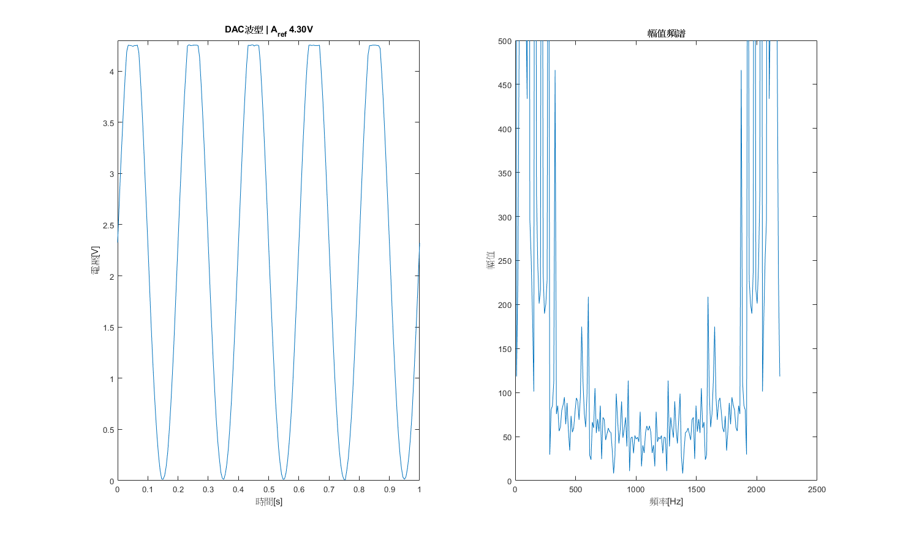

# ncu-course-programmingAndItsAppications
## 簡介
- **學校** : 國立中央大學
- **開課單位** : 機械工程學系
- **課程名稱** : 光機電介面及實驗
- **授課教授** : 江士標 教授
- **修課時間** : 2021年09月~2022年01月
- **最終成績** : 100

## Lab介紹

1. 數位資料擷取系統人機介面
   > 學習MCU，HMI，matlab之間傳遞資料，並透過matlab來分析資料

    [Report-Lab1](./lab1/report.pdf)

2. ASABUS介面卡開發-I2C
   > 學習如何透過I2C操作溫度計(TCA9534A)下的不同模式(休眠模式下單發量測/比較模式下溫度中斷警告/量測模式下固定周期量測)

    [Report-Lab2](./lab2/report.pdf)

3. ASABUS擴充介面卡開發-SPI智慧型IC
   > 學習如何透過SPI操作溫度計(TMP121)及LED點矩陣控制IC(MAX7219)

    [Report-Lab3](./lab3/report.pdf)

4. 資料擷取系統TIMER配合ADC使用
   > 學習如何使用C4MLib中的降頻器/Timer及ADC

    [Report-Lab4](./lab4/report.pdf)

5. ASA DAC介面卡開發及使用
   > 學習如何使用DAC晶片

   [Report-Lab5](./lab5/report.pdf)

6. PWM輸出及橋式驅動電路
   > 學習使用Timer來操控PWM輸出

   [Report-Lab6](./lab6/report.pdf)

7. 類比訊號處理
   > 學習(反向/非反向)放大電路, (一階/二階)低通濾波器/二階差動濾波器, 開迴路增益(Open Loop Gain), 增頻頻寬積(GBW, Gain-Bandwidth Product), 儀表放大器(AD620)的差動增益/CMRR/電磁波雜訊拾取

   [Report-Lab7](./lab7/report.pdf)

8. 感測器訊號處理
   > 學習紅外線感測器, 微動開關, 可變電阻, 光敏電阻, 電容麥克風, 馬達_發電機, 光感測器_LED, 霍爾磁場感測器如何操作及量測

   [Report-Lab8](./lab8/report.pdf)

9.  致動器，致動器驅動電路
    > 學習線性功率放大驅動電路及H全橋驅動電路

    [Report-Lab9](./lab9/report.pdf)

## Lab作業
1. 數位資料擷取系統人機介面  
    State Space Model  
    $x(k+1) = A(k)x(k) + B(k)u(k)$  
    $y(k)   = C(k)x(k) + D(k)u(k)$

    x(k+1) 表示下一個時刻的狀態  
    x(k) 表示當前時刻的狀態  
    u(k) 表示當前時刻的輸入  
    A(k), B(k), C(k) 和 D(k) 是狀態空間模型的參數矩陣

    1. 從MATLAB生成200筆```sin(30*t)```，t = -0.5~0.5 [s]，並透過HMI-API傳至ASA_M128_V2當作輸入，此時設定狀態空間參數
    ```A=1; B=0.75; C=0.5, D=0.25, x(0)=0; ```，將結果透過HMI-API再回傳給MATLAB作圖

        
    
    2. 從MATLAB生成200筆```cos(60*t+2)```，t = -0.5~0.5 [s]，並透過HMI-API傳至ASA_M128_V2當作輸入，此時設定狀態空間參數
    ```A=1; B=-1; C=1, D=-1, x(0)=1; ```，將結果透過HMI-API再回傳給MATLAB作圖

        
    
2. ASABUS介面卡開發-I2C  
    [datasheet-TCA9534A](https://www.ti.com/lit/gpn/TCA9534A)

    1. 休眠模式下單發量測

        
    2. 比較模式下溫度中斷警告

        
    3. 量測模式下固定周期量測

        

3. ASABUS 擴充介面卡開發-SPI智慧型IC  
    [datasheet-TMP121](https://www.ti.com/tw/lit/gpn/tmp121)  
    [datasheet-MAX7219](https://www.analog.com/media/en/technical-documentation/data-sheets/max7219-max7221.pdf)  
    ASA_M128_V3透過SPI量測當前溫度，並透過MAX7219使四顆七段顯示器顯示出當前溫度  
   

4. 資料擷取系統TIMER配合ADC使用
   1. Timer/降頻器/Port應用  
    f_cpu=11.0592[MHz], f_div=1024, f_timer3 = f_cpu/(f_div*(1+OCR_counter))  
    分四個時段  
      1. OCR3=1000, T_timer3~= 92.7[ms], PORTD0 = 1
      2. OCR3=2000, T_timer3~=185.4[ms], PORTD0 = 0
      3. OCR3=3000, T_timer3~=278.1[ms], PORTD0 = 1
      4. OCR3=4000, T_timer3~=370.7[ms], PORTD0 = 0
   
      
   2. ADC應用(單純使用c語言)
      設定ADC為10-bits轉換，參考電壓2.56[V]，並使用電源供應器供應0[V]/1.23[V]時，MCU所量到的ADC數值為多少。  

      |電壓[v] | 理論ADC數值 | 實際ADC數值 |
      | ---  | ---           | --- |
      | 0    | 0             | 35 |
      | 1.23 | 511(2^10/2-1) | 480 |
      | 2.56 | 1023(2^10-1)  |  |

      

    3. ADC應用(c語言+MATLAB)  
      透過HMI-API將ASA_M128的輸出傳遞至MATLAB上顯示，並計算ADC偏移數值(實際ADC數值-理論ADC數值)與計算增加一個ADC數值所對應的電壓為多少(1.23[V]/(1.23[V]之實際ADC數值-0[V]實際ADC數值))
        - ADC偏移:31
        - 一個ADC數值所對應的電壓:0.0027394[V]
  
        |電壓[v] | 理論ADC數值 | 實際ADC數值 |
        | ---  | ---           | --- |
        | 0    | 0             | 31 |
        | 1.23 | 511(2^10/2-1) | 480 |
        | 2.56 | 1023(2^10-1)  |  |

        

    4. ADC應用  
    使用單通道和雙差動通道對同一訊號進行量測，訊號為sine wave, 10[Hz], V_pp=1[V], V_offset=0.5[V]
    
        

5. ASA DAC介面卡開發及使用
   從MATLAB生成200筆```sin(t)```，t = 0~2*pi [s]，先在MATLAB中使用ADC數值轉換，再透過HMI-API丟資料給ASA_M128_V3當作輸入，並使用DAC晶片(MCP4922, 12-bits)輸出結果  
   [datasheet-MCP4922](https://ww1.microchip.com/downloads/en/DeviceDoc/22250A.pdf)
   
   

6. PWM輸出及橋式驅動電路
   1. 觀察PWM輸出頻率及波寬實驗  
      以不同頻率輸出PWM並觀察經過低通濾波器(100Ω, 10μF)的結果，由於方波是由多個頻率疊加而成，因此經過低通濾波器後，僅會讓低頻率($f_c=\frac{1}{2\pi*RC}=159[Hz]$)通過，而訊號切換(0/1)的地方則會變鈍
      - f_cpu=11.0592[MHz], f_div=256, OCR2=107, f_timer2 = f_cpu/(f_div*(1+OCR2))=400[Hz]  
      
      - f_cpu=11.0592[MHz], f_div=1024, OCR2=107, f_timer2 = f_cpu/(f_div*(1+OCR2))=100[Hz]  
      

   2. 觀察單通道PWM波寬變化波形實驗  
      由MATLAB生成200筆```square(t, duty)```，t = 0~pi [s]，duty=5%, 25%，透過HMI-API丟資料給ASA_M128_V3當作輸入，再透過PB6輸出接收到的資料，經過低通濾波器(100Ω, 10μF)及分壓(1/2, atmega128 gpio電壓為0[V]/5[V], ADC內部參考電壓為2.56[V]，因此需要分壓)後，傳送回ASA_M128_V3的ADC，最後再把轉換結果傳回MATLAB繪圖
      - Duty=5%

        

      - Duty=25%

        

   3. 觀察三通道PWM三相弦波輸出波形實驗  
      由MATLAB生成180筆```(sin(t)+1)*255/2```，t = 0~2*pi [s]，透過HMI-API丟資料給ASA_M128_V3當作輸入，再透過PWMPrePro_step切割訊號成三等份，透過Timer耦合的腳位輸出三個相位訊號(+0, +1/3*pi, +2/3*pi)PORTB7:5，經過低通濾波器(100Ω, 10μF)後，傳給ASA_M128_V3的ADC當作輸入，最後再回傳給MATLAB繪圖
        

7. 類比訊號處理  
   詳細請見Report

8. 感測器訊號處理  
   詳細請見Report
   
9. 致動器，致動器驅動電路  
   詳細請見Report


## Lab驗收
1. 數位資料擷取系統人機介面  
  從MATLAB生成300筆```sin(50*t)```，t = -0.5~0.5 [s]，並透過HMI-API傳至ASA_M128_V2當作輸入，此時設定狀態空間參數```A=0.5; B=0.45; C=0.35, D=0.25, x(0)=0.15; ```，將結果透過HMI-API再回傳給MATLAB作圖

      


2. ASABUS介面卡開發-I2C  
  ASA_M128_v3即時將溫度計透過HMI-API傳遞給MATLAB繪製當前溫度

3. ASABUS擴充介面卡開發-SPI智慧型IC
  ASA_M128_V3透過SPI量測當前溫度，並透過MAX7219使四顆七段顯示器顯示出當前溫度，額外使七段顯示器閃爍(每1秒不顯示0.1秒)

4. 資料擷取系統TIMER配合ADC使用
   將HW4_3的單/雙差動通道ADC結果傳遞至MATLAB，並使用FFT來查看頻譜

5. ASA DAC介面卡開發及使用
  在 MATLAB 生成 200 筆 `sin(1000*t)` 的資料,轉換為 12 位元 ADC 值後,透過 HMI-API 傳送給 ASA_M128_V3 板子,ASA_M128_V3 再將資料傳送給外部的 DAC 晶片(MCP4922, 12-bits)輸入,DAC 晶片的輸出再接回 ASA_M128_V3 的 ADC 輸入,最後 ASA_M128_V3 將 ADC 讀取值透過 HMI-API 回傳給 MATLAB 進行頻譜分析

    

6. PWM輸出及橋式驅動電路  
   將HW6_3從三相位改成雙相位

## 開發環境與需求
- **AVR-gcc**  
  [Atmel-Studio](https://www.microchip.com/en-us/tools-resources/develop/microchip-studio/gcc-compilers)
- **C4MLIB v3.7.0**
  
- **ASA_M128_V2(AVR ATMega128)**  
    [ASA官網](http://asarobot.tw/asa-m128/)

- **HMI**  
  [ASA_HMI_Data_Agent](https://gitlab.com/MVMC-lab/hmi/ASA_HMI_Data_Agent)

- **HMI-api-matlab**  
  [ASA_HMI_Data_Agent_MATLAB_API](https://gitlab.com/MVMC-lab/hmi/hmi-api-matlab/-/releases)

## 修課心得
這是一門我大學期間修了兩年的課程。由於這門課的工作量非常大，導致許多同學無法在大三上學期完成。因此，我在大二時就開始慢慢摸索，邊向學長請教邊慢慢做實驗。

在這兩年的修課期間，老師對講義曾進行了大幅度的改版，這也使得有些實驗需要重做，我花了很多時間去探索 ATmega128 與 C4Mlib 這套由老師和實驗室共同開發的函式庫。由於在編寫講義的時候，部分函式庫的功能還沒有經過完整測試，因此我經常需要和學長一起找出函式庫中的 Bug。在這個過程中，我邊做實驗邊學習，收穫頗豐。